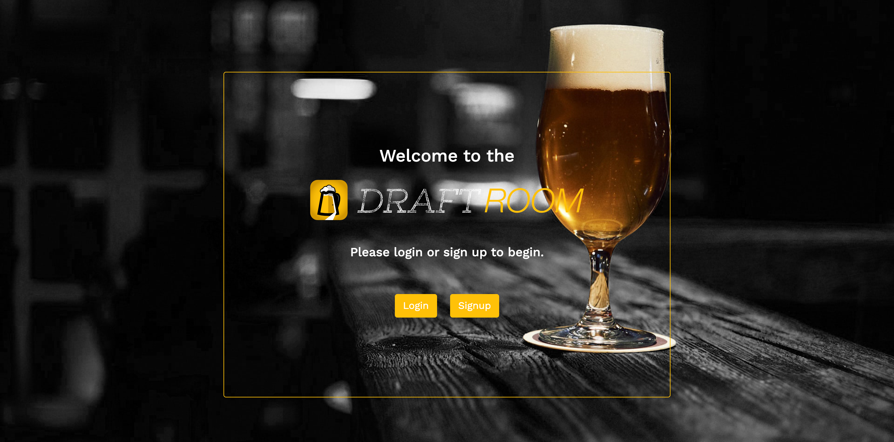

# Draft Room
[](https://opensource.org/licenses/ISC) [](https://github.com/gabrielazalta/draft-room/issues) [](https://github.com/gabrielazalta/draft-room/graphs/contributors)

## Purpose
This is a CMS-style blog site created so that beer lovers can have a space to publish their own posts, interact with other people's posts and have their own dashboard with their personal information, their posts, and other cool features. This application follows the MVC paradigm in its architectural structure, using Handlebars.js as the templating language, Sequelize as the ORM, and the express-session npm package for authentication.

## Table of Contents
* [Installation](#Installation)
* [Built With](#Built-With)
* [License](#License)
* [Website & Screenshot](#Website-&-Screenshot)
* [Contribution](#Contribution)

## Installation
To install, you will need the following npm package dependencies: 
```
npm i init
```
```
npm i mysql2
```
```
npm i express
```
```
npm i sequelize
```
```
npm dotenv
```
Once done, and have cloned or forked from this repo, be sure to source your schema and seeds before launching your server. Then, simply type 'npm start' to begin!

## Built With
* Node.js
* Express.js
* Handlebars.js
* Sequelize
* mySql2
* JavaScript
* Bootstrap
* HTML
* CSS

## License
This application is under the [ISC](https://opensource.org/licenses/ISC) license.

## Website & Screenshot

[Deploy Here](https://sleepy-island-61088.herokuapp.com/)




## Contribution
Made with ❤️ (and a few 🍺's) by [Jessica Coneff](https://github.com/jconeff), [Dalton Morrel](https://github.com/Dmorrel7), [Ruben Matamoros](https://github.com/valiantcreative33), and [Gabriela Zalta](https://github.com/gabrielazalta).
